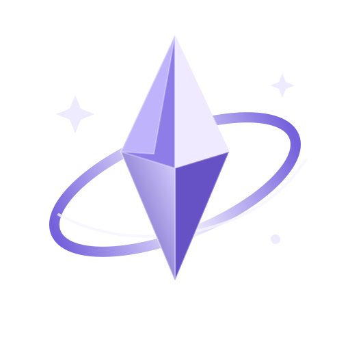

# Osmium

**Bring Blockbench models to life on modern Paper servers.**

Osmium is an open-source, clean-room, ModelEngine-style renderer for Paper Minecraft servers. It loads Blockbench `.bbmodel` files, compiles their parts into Minecraft resource-pack assets, and renders animated models with native display entities.

Osmium is built around a simple workflow: **drop in a model, reload, generate the pack, and spawn it**. It does not require ModelEngine.

[](https://openjdk.org/)
[](https://papermc.io/)
[](https://github.com/aliceblackrose/osmium/releases/latest)
[](https://jitpack.io/#aliceblackrose/osmium)
[](LICENSE)

<br clear="right">

> [!IMPORTANT]
> Osmium is under active development. Model loading, rendering behavior, configuration, and the public API may change between releases.

## Features

- **Blockbench model loading** — load `.bbmodel` files directly from the plugin's blueprint directory.
- **Display-entity rendering** — render model parts with native Bukkit/Paper display entities.
- **Animation playback** — play animations embedded in loaded Blockbench models.
- **Mob attachment** — attach runtime models to living entities.
- **Automatic resource-pack generation** — generate item models, textures, custom model data, and distributable pack archives.
- **Model hitboxes** — create interaction entities for custom model hitboxes.
- **Native shadows** — render one automatically sized display shadow per model.
- **Debug tooling** — inspect loaded models, cubes, textures, UVs, animations, and hitboxes in-game.

## Requirements

| Requirement | Version |
| --- | --- |
| Java | **25** |
| Paper | **26.1.x** |
| Model format | Blockbench `.bbmodel` |

Osmium is currently built against the Paper `26.1.2` development bundle.

## Quick start

### 1. Install Osmium

Download the latest plugin JAR from [GitHub Releases](https://github.com/aliceblackrose/osmium/releases/latest), then place it in your server's `plugins/` directory.

Start the server once so Osmium can create its files and directories.

### 2. Add a Blockbench model

Place your `.bbmodel` file in:

```text
plugins/Osmium/blueprints/
```

### 3. Reload models and generate the resource pack

```text
/om reload
/om pack
```

Osmium writes the generated pack to:

```text
plugins/Osmium/resource_pack/
```

The output includes:

```text
pack.zip
pack-<hash>.zip
```

Apply or distribute the generated resource pack before spawning models.

### 4. Spawn a model

List the models Osmium loaded:

```text
/om list
```

Spawn one at your location:

```text
/om spawn <model>
```

Or attach a model to a newly spawned mob:

```text
/om spawnmob zombie <model>
```

## Commands

All Osmium commands require `osmium.admin`. The legacy `modelenginelike.admin` permission is also accepted for compatibility.

| Command | Description |
| --- | --- |
| `/om reload` | Reload configuration and models, then remove active runtime models. |
| `/om pack` | Generate the resource pack. |
| `/om list` | List loaded models. |
| `/om spawn <model> [animation]` | Spawn a standalone runtime model at your location. |
| `/om spawnmob <entity_type> <model> [animation]` | Spawn a living mob with an Osmium model attached. |
| `/om play <runtime_id> <animation>` | Play an animation on an existing runtime model. |
| `/om remove <runtime_id>` | Remove one runtime model. |
| `/om remove all` | Remove all active runtime models. |
| `/om debug <model>` | Show model, cube, hitbox, texture, UV, and animation debug information. |

## Animations

Animations are read from the loaded Blockbench model and can be started when the model is spawned:

```text
/om spawn <model> idle
/om spawnmob zombie <model> walk
```

You can also change the animation of an existing runtime model:

```text
/om play <runtime_id> <animation>
```

For mob-attached models, Osmium recognizes common animation-name groups when selecting behavior automatically:

| Behavior | Common names |
| --- | --- |
| Idle | `idle`, `stand`, `standing` |
| Movement | `walk`, `walking`, `move`, `moving`, `run`, `running` |
| Interaction | `talk`, `talking`, `speak`, `speaking`, `interact` |
| Attack | `attack`, `attacking`, `bite`, `melee`, `shoot` |
| Damage | `hurt`, `damaged`, `damage`, `hit` |
| Death | `death`, `die`, `dying` |

## Configuration

Osmium creates `plugins/Osmium/config.yml` on first launch. The source defaults live in [`src/main/resources/config.yml`](src/main/resources/config.yml).

The most commonly changed options are:

| Option | Purpose |
| --- | --- |
| `namespace` | Namespace used by generated resource-pack assets. |
| `base-item` | Minecraft item used as the generated model-part carrier. |
| `custom-model-data-start` | First custom-model-data value reserved for generated parts. |
| `pack-format` | Resource-pack format written to `pack.mcmeta`. |
| `blueprints-folder` | Directory scanned for `.bbmodel` files. |
| `resource-pack-folder` | Directory used for generated pack files. |
| `auto-generate-pack-on-reload` | Regenerate the pack whenever `/om reload` runs. |
| `render.view-range` | Display-entity view range. |
| `render.scale` | Global runtime render scale. |
| `render.ground-align` | Align models to the ground. |
| `render.shadow-enabled` | Enable the model's native display shadow. |
| `render.shadow-radius` | Shadow radius. `0.0` automatically derives it from the model footprint. |
| `render.shadow-strength` | Native shadow opacity from `0.0` to `1.0`. |
| `render.brightness-override` | Use fixed block/sky brightness instead of vanilla world lighting. |

Osmium emits a single root-anchored native display shadow per model instead of a shadow for every model part. These are Minecraft's normal soft display-entity shadows; they are not geometry-projected or ray-traced shadows.

## Using Osmium as a dependency

Osmium can be consumed through JitPack.

Add JitPack to your repositories:

```kotlin
dependencyResolutionManagement {
    repositories {
        mavenCentral()
        maven("https://repo.papermc.io/repository/maven-public/")
        maven("https://jitpack.io")
    }
}
```

Then add Osmium as a compile-only dependency:

```kotlin
dependencies {
    compileOnly("com.github.aliceblackrose:osmium:<tag-or-commit>")
}
```

For development against the current `master` branch:

```kotlin
dependencies {
    compileOnly("com.github.aliceblackrose:osmium:master-SNAPSHOT")
}
```

For reproducible builds, prefer an immutable Git tag or commit instead of a moving snapshot.

Use `compileOnly` when Osmium is installed separately as a Paper plugin at runtime.

## Building from source

Clone the repository:

```bash
git clone https://github.com/aliceblackrose/osmium.git
cd osmium
```

Build with the included Gradle wrapper:

```bash
./gradlew clean build
```

On Windows:

```bat
gradlew.bat clean build
```

Compiled artifacts are written to:

```text
build/libs/
```

## Architecture and development

Osmium uses Java 25, Gradle Kotlin DSL, Paper API, Bukkit display entities, interaction entities, and generated custom-model-data assets.

More detailed implementation notes live under [`docs/`](docs/):

- [`ROADMAP.md`](docs/ROADMAP.md) — phased implementation roadmap, acceptance criteria, PR sequence, and risk register.
- [`ARCHITECTURE_PLAN.md`](docs/ARCHITECTURE_PLAN.md) — model/compiler/runtime/API architecture and migration strategy.
- [`ANIMATION_ENGINE.md`](docs/ANIMATION_ENGINE.md) — compiled animation pipeline and packet-rendering design.

The current architecture work prioritizes an immutable compiled-model pipeline, decomposition of `RuntimeModel`, and a stable `osmium.api` surface before larger feature expansion.

## Permissions

```yaml
osmium.admin:
  default: op

modelenginelike.admin:
  default: op
```

`modelenginelike.admin` exists only as a legacy compatibility alias.

## License

Osmium is licensed under the [GNU General Public License v3.0](LICENSE).
